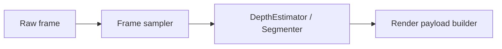
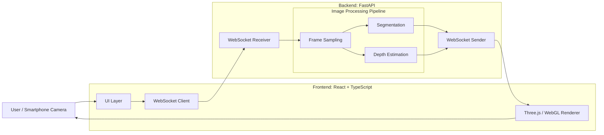
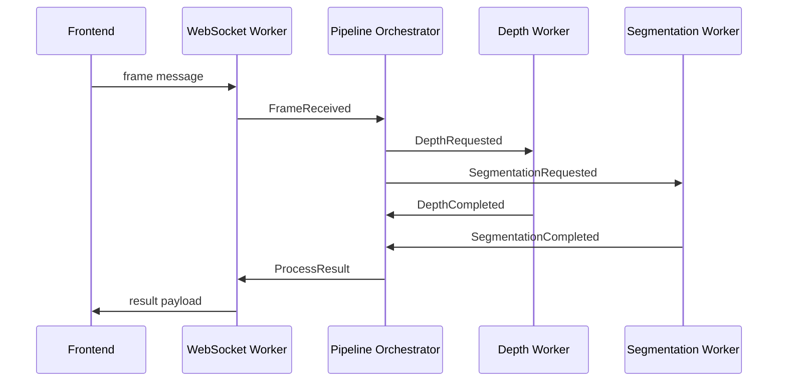

# プロジェクト名: Kaleidoscope
# 概要
このプロジェクトはスマホの画面を通した異世界を覗く体験を作成する。

具体的にはスマートフォンで景色を写すとスマートフォンに現実世界をベースにリアルタイムに処理された異世界風の景色が映し出されます。

FrontendでReact+TypeScriptでバックエンドの処理をもとに画像処理を行います。

バックエンド側の処理はFastAPIを使用しFrontendからの画像を機械学習を使用して加工に必要な情報をFrontendに返します。
システムは以下のような流れで処理する

# コンセプト
## プロダクトのコンセプト
  - スマホを異世界を覗く窓にする
## 技術側のコンセプト
  - カメラで取得し加工した動画を遅延なく処理させる
    - リアルタイムで動画の加工と表示を行う
    - Frontendでの動画の取得から表示までの遅延は0.5秒以内とする
# 使用要素
## Frontend
  - フレームワーク: React
  - 言語: TypeScript
  - 画像加工: WebGL
## Backend
  - フレームワーク: FastAPI
  - 言語: Python
  - 深度推定: MiDaS
  - セマンティックセグメンテーション: segformer
# アーキテクチャ
このプロジェクトでは、イベント駆動型のリアルタイム推論パイプラインを採用する
## 処理フロー
映像処理のデータフローはPipes & Filtersとして分解し、以下の流れで責務を分解する。


## イベント駆動
一方で各Filterの起動、推論完了通知、フレーム破棄、セッション切断、結果返却などの各責務を接続するアーキテクチャとしてイベント駆動を採用する。

深度推定、セマンティックセグメンテーション以外のデータ加工の追加の容易性、WebSocketからWebRTCへの換装などのPipe & Filterの各要素を差し替えることが可能であるためイベント駆動を採用している。

また、すべてを非同期処理で行うイベント駆動アーキテクチャとリアルタイム処理の相性が良いこともありイベント駆動アーキテクチャを使用する。
これによりデータ変換の見通しと、リアルタイム処理に必要な非同期制御を分離する


バックエンドは以下のようなイベント駆動アーキテクチャを採用する

Pipeline Orchestratorを中心にWebSocketと各種プロセスを実行する。
```
Pipeline OrchestratorはWebSocketの送受信や深度推定、セマンティックセグメンテーションなどの実処理は責務とせず処理の流れの旗振り役を責務とする
```
# リアルタイム体験を守るための設計判断
このプロジェクトでは、すべてのフレームを高精度に処理することよりも、
ユーザーが現在見ている風景と画面上の表現が同期していることを重視する。

そのため、処理が遅延した古いフレームを保持し続けるのではなく、処理が遅延したフレームを破棄し、最新の入力に追従する設計とする。
## Frontend
  Frontendは、カメラ映像の取得と最終的な描画を担当する。

  Backendから返却された深度推定・セマンティックセグメンテーションなどの情報を利用し、WebGLでエフェクトを重ねることで、描画処理をユーザー端末側に寄せる。

  Backendの処理結果が遅延している場合でも、最後に受け取った処理結果を使用して映像の加工と描画は継続する。
  推論結果と現在のフレームが完全に一致しない可能性はあるが、本プロジェクトでは厳密な画像一致よりも、体験全体のリアルタイム性を優先する。
## Backend
  Backendは、加工済み映像そのものではなく、描画に必要な補助情報を生成することを責務とする。

  主な処理は以下とする。

    - Frontendから映像フレームの受信
    - 処理対象フレームの選択
    - 深度推定
    - セマンティックセグメンテーション
    - 描画用Payloadの生成
    - Frontendへの結果返却

  セッションごとに処理待ちのフレーム数は1つに制限し、処理中に新しいフレームを受信した場合は、処理が間に合わないフレームを破棄し新しいフレームを新たな待ちフレームとする。
  これにより、処理遅延が蓄積して「過去の映像に対する推論結果」を表示し続ける状態を避ける。

  また、WebSocketの送受信、推論処理、結果返却を役割ごとに分離し、一部の処理待ちが全体の停止につながらない構成を目指す。
  その中でも、深度推定とセマンティックセグメンテーションの推論処理は処理時間が大きくなりやすいため、WebSocketの送受信処理とは分離して実行する。

  これにより、推論処理の待ち時間が通信処理全体を塞がない構成を目指す。