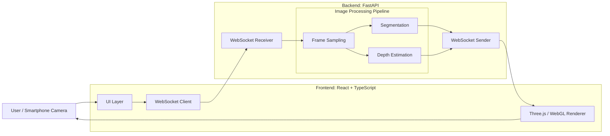
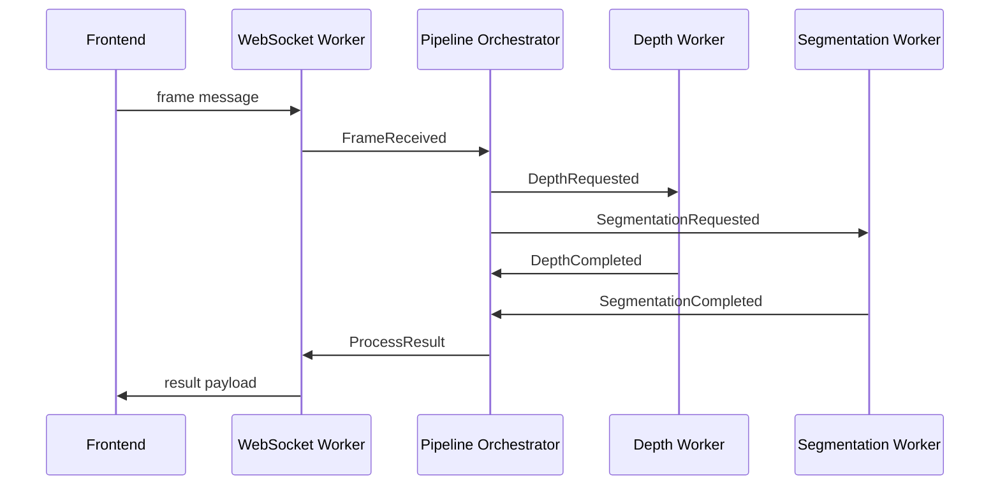

# 1. プロダクトの目標

Kaleidoscopeは、スマートフォンから取得した映像をもとに、バックエンドでフレーム内の物体までの距離などの描画に必要な情報を推論・抽出し、その結果をフロントエンドのWebGL描画に反映するリアルタイムAI Webアプリケーションである。

本設計では、全フレームを完全に処理することよりも、表示遅延を増やさずに最新の映像体験を維持することを優先する。
# 2. プロダクトのスコープ
## 必要な機能
### Frontend
  - カメラからの動画（画像）の取得
  - バックエンドへのWebsocketを通しての動画の送信
  - バックエンドからのWebsocketを通しての情報を受信
  - バックエンドの処理情報を使用して動画の加工
    - エフェクトの追加
      - 深度推定の結果を使用する
    - テクスチャの変更
      - セマンティックセグメンテーションの結果を使用する
### Backend
  - バックエンドでセッション単位での状態管理
  - 深度推定・セグメンテーションの非同期実行
  - 最新フレームの優先と遅延フレームの破棄
## 必要ない機能
  - 全フレームの完全な処理
  - 複数ユーザーの高負荷時のスケーリング
  - 品質の高い画像の加工
  - 高精度な深度推定・セマンティックセグメンテーション
  - WebRTCを使った映像データの送信
# 3. 全体の方針
Kaleidoscopeでは、イベント駆動型のリアルタイム推論パイプラインを採用する。

映像処理のデータ変換はPipes & Filtersとして分解し、各Filterは単一の変換責務を持つ。一方で、各Filterの起動、推論完了通知、フレーム破棄、セッション切断、結果返却はPipeline Orchestratorがイベント駆動で制御する。
### Pipe & Filterアーキテクチャイメージ

### イベント駆動アーキテクチャイメージ

# 4. プロセスイベント
  ## 4.1 セッションごとのプロセスイベント
  各セッションごとに持たせるプロセス。Websocketなどのセッションごとに処理が必要となるプロセスや同一のセッションで時間的に連続したデータを処理する必要があるプロセス。
  - Websocket受信プロセス
    - Websocketのデータは逐次的に受信するためWorkerプロセスとする
    - 受信したデータをPipeline Orchestratorが理解できるイベントへ変換する
  - Websocket送信プロセス
    - 逐次的にデータの送信するWorkerとする
  - 処理動画フレームの決定
    - Workerとする。
    - フロントエンドから送られてきたフレームを監視する
    - セッションごとに処理待ちフレームは１つ
      - 新しいフレームを優先し処理されなかったフレームは廃棄する
  ## 4.2 セッション共通のプロセスイベント
  完全にステートレスなプロセス。
  単一のフレームに対しての処理などの時系列の連続性が求められないプロセスはアプリケーション内のすべてのセッションで共有される。
  - Pipeline Orchestrator
    - 各Worker、各オーケストラ間のデータの受け渡しを行う。
  - Depth Orchestrator
    - 深度推定プロセスの統制Workerとする
      - 深度推定のWorkerを配下とする
    - 起動するプロセスの管理
      - 各プロセスの起動数の上限を決定する
        - プロセスごとに専用のモデルインスタンスを割り当てる
          - 例: 深度推定のプロセスを10個を上限とする場合
            - MiDaSを10個ロードする
    - 処理待ちのフレームをプロセスに割り当てる
      - プロセスを起動し処理が完了したプロセスのモデルの割り当て
      - 深度推定プロセスのライフサイクルの管理
  - Semantic Segmentation Orchestrator
    - セマンティックセグメンテーションプロセスの統制Workerとする
      - セマンティックセグメンテーションのWorkerを配下とする
    - 起動するプロセスの管理
      - 各プロセスの起動数の上限を決定する
        - プロセスごとに専用のモデルインスタンスを割り当てる
          - 例: セマンティックセグメンテーションのプロセスを10個を上限とする場合
            - Segformerを10個ロードする
    - 処理待ちのフレームをプロセスに割り当てる
      - プロセスを起動し処理が完了したプロセスのモデルの割り当て
      - セマンティックセグメンテーションプロセスのライフサイクルの管理
  - 動画の深度推定処理
    - 入力されたフレームに対して深度推定を行うプロセス
  - 動画のセマンティックセグメンテーション処理
    - 入力されたフレームに対してセマンティックセグメンテーションを行うプロセス
- 接続セッションの管理
  - 接続Websocketの管理
  - データ受け渡し用のQueueの管理
# 5. 処理の流れ
## 5.1 Frontend
  1. カメラを起動し、動画の取得
  2. Websocketを通して取得した動画をバックエンドに送信
  3. バックエンドの処理結果をWebsocketを通じて受信する
  4. 深度推定の結果を使用してエフェクトを追加する
    - 深度が深いほど小さくなる雪のようなエフェクトの追加
  5. セマンティックセグメンテーションの結果を使用してテクスチャの変更を行う
    - 木、建物、道路に対して個別にテクスチャを適用する
      - テクスチャを作るのには手間がかかるため、最初は色味を変えることに留める
  6. 加工した動画を表示する
    - バックエンドからの処理を１つも受け取れない場合は加工前の動画をそのまま表示する
    - １つでもフレームを受け取れている場合は最新のフレームを表示する
  ```
    デバックのためにカメラで取得した画像、深度推定の結果、セマンティックセグメンテーションの結果、加工後の結果のすべてを表示する。
  ```
## Backend
### 5.2 エンドポイントURL
1. セッションの起動
    - セッション固有のQueueとインスタンスの作成
    - 生データ受け渡し用のバッファの作成（Queueではなくメモリ空間に直接保持する方向性）
    - セッション固有のWorkerの起動
### Websocket received Worker
1. Websocketを通して動画を受け取り、最新のフレームを処理待ちフレームとする
    - 処理が完了していないフレームを廃棄
2. 処理待ちのフレームがあることをPipeline OrchestratorにPipeline Orchestrator入力Queueを通して受け渡し
3. セッションIDを付与したフレームをセッションのバッファに保存
### Pipeline Orchestrator
1. 処理待ちのフレームがあるセッションのバッファを読み込み
2. Depth OrchestratorへフレームをDepth Orchestratorの入力Queueを通して受け渡し
3. Semantic Segmentation OrchestratorへフレームをSemantic Segmentation Orchestratorの入力Queueを通して受け渡し
4. 各処理の処理結果をWebsocket Worker用のQueueを通して受け渡し
### Depth Orchestrator
1. オーケストラがフレームを受け取る
2. プロセスの上限数以下なら新たにプロセスを起動しフレームを処理
    - 上限まで起動している場合は待機
3. プロセスの結果を受け取り中央制御用のオーケストラに渡す
4. 完了したプロセスのモデルのインスタンスを回収
5. 新たにプロセスを起動し改修したモデルのインスタンスを割り当て
6. 待機させたフレームを新たに起動したプロセスで処理
7. 処理結果をPipeline Orchestrator入力Queueを通して受け渡し
### Semantic Segmentation Orchestrator
1. オーケストラがフレームを受け取る
2. プロセスの上限数以下なら新たにプロセスを起動しフレームを処理
    - 上限まで起動している場合は待機
3. プロセスの結果を受け取り中央制御用のオーケストラに渡す
4. 完了したプロセスのモデルのインスタンスを回収
5. 新たにプロセスを起動し改修したモデルのインスタンスを割り当て
6. 待機させたフレームを新たに起動したプロセスで処理
7. Pipeline Orchestrator入力Queueを通して受け渡し
### Websocket send Worker
1. Pipeline Orchestratorから処理結果を受け取る
2. 処理結果をJSONファイルとしてフロントエンドに送り返す

# 6. イベントモデル

内部処理では、通信方式に依存しないイベントを使用する。

### Events

#### FrameReceived
WebSocketReceiveWorkerがフレームを受信したときに発行する。

Fields:
- session_id
- frame_id
- timestamp
- payload

#### DepthRequested
深度推定を要求するイベント。

Fields:
- session_id
- frame_id
- timestamp
- frame_ref

#### DepthCompleted
深度推定が完了したときのイベント。

Fields:
- session_id
- source_frame_id
- depth_map
- latency_ms

#### SegmentationRequested
セマンティックセグメンテーションを要求するイベント。

Fields:
- session_id
- frame_id
- timestamp
- frame_ref

#### SegmentationCompleted
セマンティックセグメンテーションが完了したときのイベント。

Fields:
- session_id
- source_frame_id
- segmentation_mask
- latency_ms

#### ResultPublishRequested
フロントエンドへ描画用データを返すためのイベント。

Fields:
- session_id
- frame_id
- timestamp
- payload